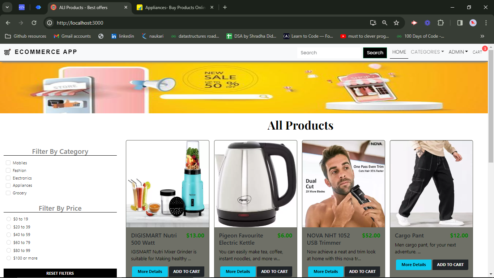

# E-Commerce Application.
This is full stack MERN application where users can buy things online and get delivered to there home address, and able to check the status of the ordered products.  

# Stack used

Reactjs, Expressjs, Nodejs, Mongodb, Bootstrap, HTML/CSS, JWT and many more libraries.




## Installation Guide for backed, refer Readme.md file to set up frontend of the application.

### Requirements

- [Nodejs](https://nodejs.org/en/download)
- [Mongodb](https://www.mongodb.com/docs/manual/administration/install-community/)

Both should be installed and make sure mongodb is running.

```shell
git clone https://github.com/hvsanthosh/ecommerce.git
cd ecommerce
```

add below credential in .env file on route directory for server.

PORT=8080
DEV_MODE=development
MONGO_URL=
# random text to encrypt
JWT_SECRET=
# for payment gateway
BRAINTREE_MERCHANT_ID=
BRAINTREE_PUBLIC_KEY=
BRAINTREE_PRIVATE_KEY=

Now install the dependencies

```shell

npm i
cd ..
cd client
npm i
```

We are almost done, Now just start the development server.

We are using cuncurrently so just got to root directory and run this command.

```shell
npm start


